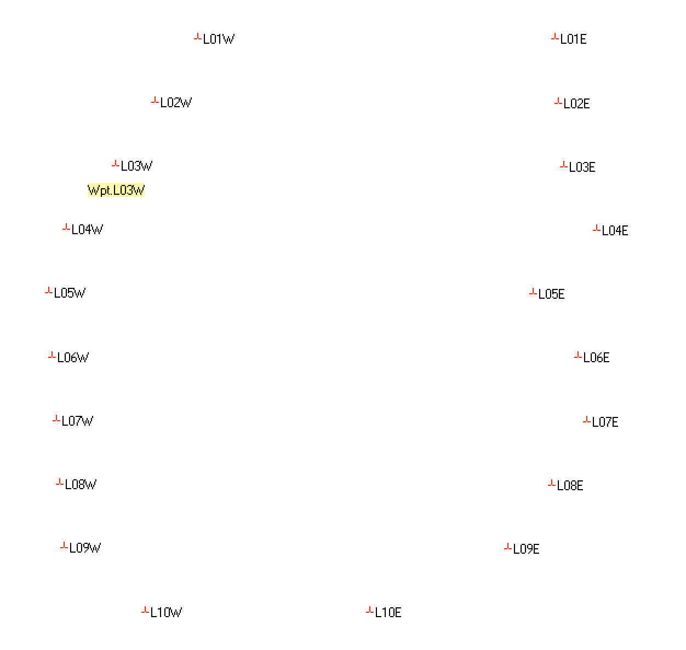
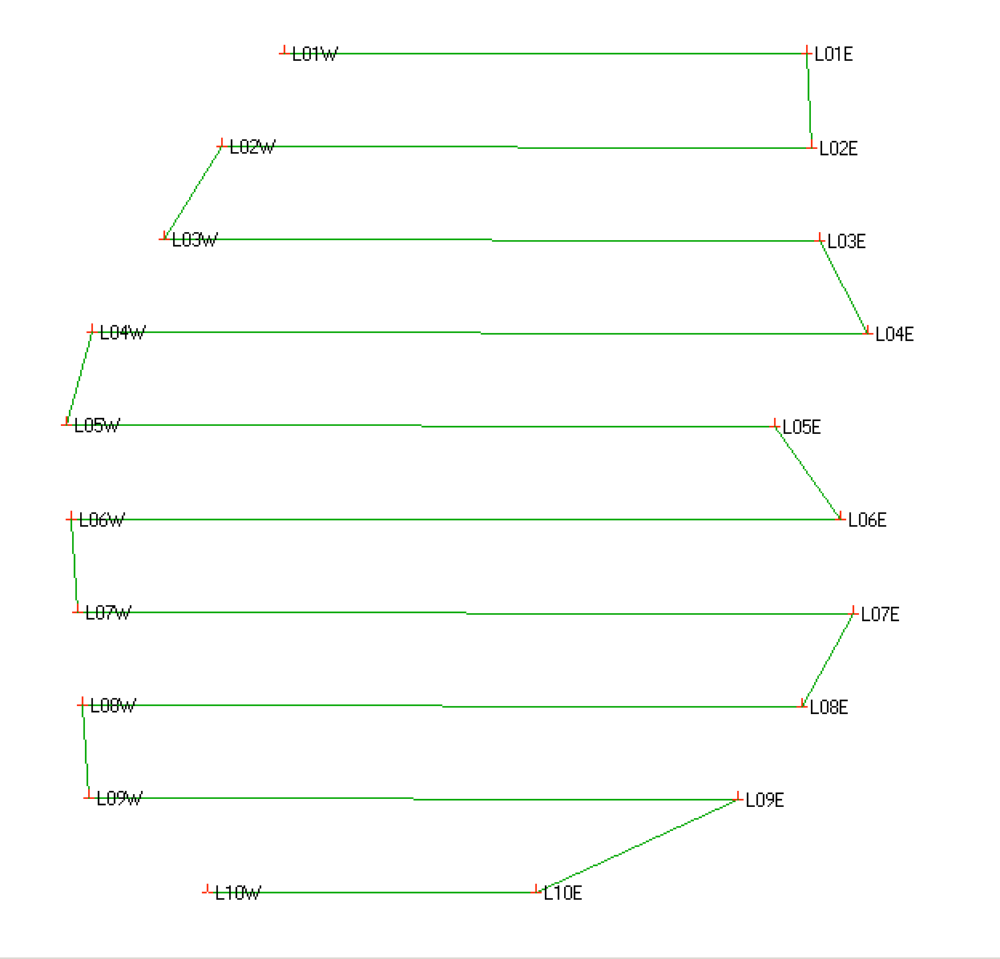
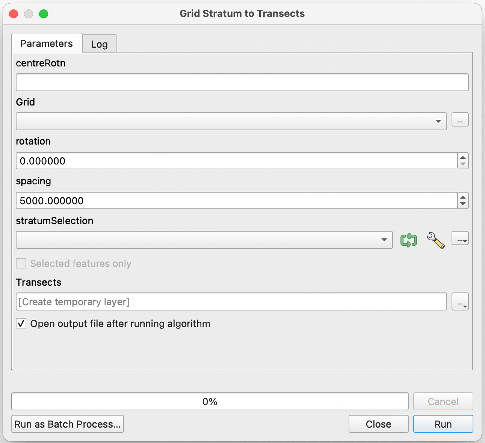

# TransectTools
A collection of transect tools for GPS, analysis and fieldwork

Transects are usually straight lines along which observations or samples are taken. The tools here are meant to set up transects for a given geographic sample area and create route files for usage on GPS units for field navigation.

General conventions:
* Transect geometry: for now, all transects are 2-node lines (one start point, one end, nothing in the middle).
* Transect name: each transect should have a unique ID or name, ideally sortable. 
  * 01, 02, 03 ... 99 - numbers padded with 0s.
  * A01, A02, A03 ... - stratum code and padded number.
  * A, B, C, D ... - alphanumeric code.
* Transect endpoints: each transect should have unique endpoints named by the transect ID and the position relative to the centroid, i.e. A01E and A01W for the east and west points of transect A01. The 'position' signifier should be 1-character from E, W, N, S.

## points2route

    usage: points2route.py [-h] -i INFILE [-o OUTFILE] [-r ROUTE] [-w SWAP]
                          [-s SORT]
    
    optional arguments:
    -h, --help            show this help message and exit
    -i INFILE, --infile INFILE
                          path to input GPX file
    -o OUTFILE, --outfile OUTFILE
                          path to output GPX file with route
    -r ROUTE, --route ROUTE
                          Route name.
    -w SWAP, --swap SWAP  Swap the starting side
    -s SORT, --sort SORT  Sort the waypoints by name before routing. Default 0
                          (do nothing), 1 to sort alphabetically by name, -1 to
                          sort in reverse.

 

| Input: a GPX file with transect endpoints (2 per transect) following the [ID][Position] format above.    | Output: a GPX file with added route providing a 'snake' pattern.     |
| ---- | ---- |
|  |  |

## StratumToTransects

QGIS 3.x model and Processing code for clipping a grid of transect lines with a survey stratum, rotating around a centre point if required.

Installation: requires [QGIS 3.x](www.qgis.org).

1. Download `StratumToTransects.model3`
2. Open QGIS and the Processing panel.
3. Select "open existing model" from the Processing panel toolbar, then select `StratumToTransects.model3`

Usage:

* `centreRotn` - centre point of the stratum around which rotations are made (this should be calculated automatically but is in the ToDo list)
* `Grid` - select the grid layer
* `rotation` - rotation amount in degrees, 0-360
* `spacing` - if you want to have a random shift for the transect grid, put in the spacing of the grid. Leave as 0 for no random shift.
* `stratumSelection` - the stratum to use to clip the transects.

Output:

Produces a layer of transect lines which can then be named and used in survey design.

